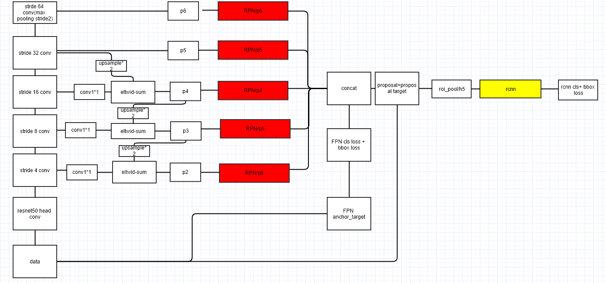
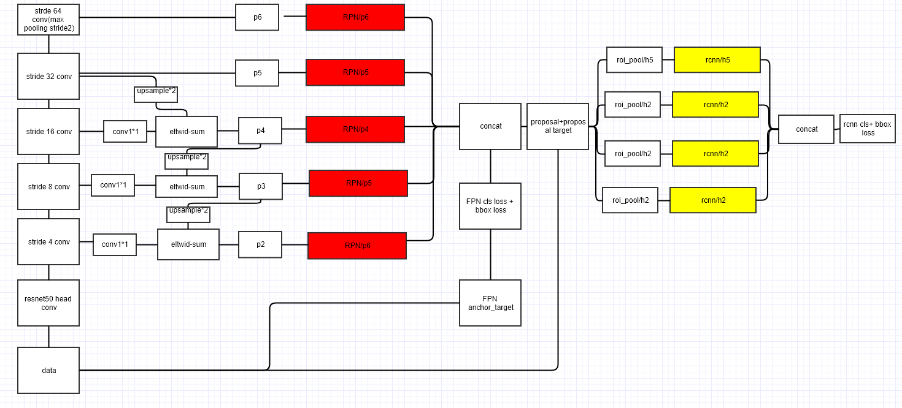

Feature Pyramid Network on caffe

This is the unoffical version  Feature Pyramid Network for Feature Pyramid Networks for Object Detection https://arxiv.org/abs/1612.03144

# results
`FPN(resnet50)-end2end result is implemented without OHEM and train with pascal voc 2007 + 2012 test on 2007`

merged rcnn

|mAP@0.5|aeroplane|bicycle|bird|boat|bottle|bus|car|cat|chair|cow|
|:--:|:-------:| -----:| --:| --:|-----:|--:|--:|--:|----:|--:|
|0.788|0.8079| 0.8036| 0.8010| 0.7293|0.6743|0.8680|0.8766|0.8967|0.6122|0.8646|

|diningtable|dog |horse|motorbike|person |pottedplant|sheep|sofa|train|tv|
|----------:|:--:|:---:| -------:| -----:| -------:|----:|---:|----:|--:|
|0.7330|0.8855|0.8760| 0.8063| 0.7999| 0.5138|0.7905|0.7755|0.8637|0.7736|


shared rcnn

|mAP@0.5|aeroplane|bicycle|bird|boat|bottle|bus|car|cat|chair|cow|
|:--:|:-------:| -----:| --:| --:|-----:|--:|--:|--:|----:|--:|
|0.7833|0.8585| 0.8001| 0.7970| 0.7174|0.6522|0.8668|0.8768|0.8929|0.5842|0.8658|

|diningtable|dog |horse|motorbike|person |pottedplant|sheep|sofa|train|tv|
|----------:|:--:|:---:| -------:| -----:| -------:|----:|---:|----:|--:|
|0.7022|0.8891|0.8680| 0.7991| 0.7944| 0.5065|0.7896|0.7707|0.8697|0.7653|
# framework
megred rcnn framework

Network overview: [link](http://ethereon.github.io/netscope/#/gist/c5334efdd667ce41d540e3697de2936c)



shared rcnn

Network overview: [link](http://ethereon.github.io/netscope/#/gist/63c0281751afd1b2d50f4c2764b31a4e)


`the red and yellow are shared params`
# about the anchor size setting
In the paper the anchor setting is `Ratios： [0.5,1,2],scales :[8,]`

With the setting and P2~P6, all anchor sizes are  `[32,64,128,512,1024]`,but this setting is suit for COCO dataset which has so many small targets.

But the voc dataset targets are range `[128,256,512]`.

So, we desgin the anchor setting:`Ratios： [0.5,1,2],scales :[8,16]`, this is very import for voc dataset.

# usage
download  voc07,12 dataset `ResNet50.caffemodel` and rename to `ResNet50.v2.caffemodel`

```bash
cp ResNet50.v2.caffemodel data/pretrained_model/
```
- OneDrive download: [link](https://onedrive.live.com/?authkey=%21AAFW2-FVoxeVRck&id=4006CBB8476FF777%2117887&cid=4006CBB8476FF777)

`In my expriments, the codes require ~10G GPU memory in training and ~6G in testing. 
your can design the suit image size, mimbatch size and rcnn batch size for your GPUS.`
### compile  caffe & lib
```bash
cd caffe-fpn
mkdir build
cd build
cmake ..
make -j16 all
cd lib
make 
```
### train & test
shared rcnn
```bash
./experiments/scripts/FP_Net_end2end.sh 1 FPN pascal_voc
./test.sh 1 FPN pascal_voc
```
megred rcnn
```bash
 ./experiments/scripts/FP_Net_end2end_merge_rcnn.sh 0 FPN pascal_voc
 ./test_mergercnn.sh 0 FPN pascal_voc
```
0 1 is GPU id.

### TODO List
 - [x] all tests passed
 - [x] evaluate  object detection  performance on voc
 - [x] evaluate merged rcnn version  performance on voc
 
### feature pyramid networks for object detection

Lin, T. Y., Dollár, P., Girshick, R., He, K., Hariharan, B., & Belongie, S. (2016). Feature pyramid networks for object detection. arXiv preprint arXiv:1612.03144.
